# Union Shop App

## Description
- Union Shop App is a Flutter web experience that recreates key areas of the UPSU shop. It includes a promotional hero, dropdown-enabled navbar, collections landing page, and dedicated Essentials page featuring reusable product cards with overlay-entry dropdowns.

## Key Features
- Sticky navbar with “Shop” dropdown rendered via OverlayEntry
- Collections page with hero-style tiles (Essentials, Winter, Merchandise, Personalisation)
- Essentials collection page showing product cards for men’s and women’s hoodies
- Consistent purple promo banner and shared footer across pages
- Responsive grid layouts using GridView.count and adaptive aspect ratios

## Installation and Setup

### Prerequisites
- Windows, macOS, or Linux
- [Flutter SDK](https://docs.flutter.dev/get-started/install)
- [Git](https://git-scm.com/)
- [VS Code](https://code.visualstudio.com/)

### Clone the Repository
```bash
git clone https://github.com/sushisuj/union_shop.git
cd union_shop
```
### Install Dependencies
```bash
flutter pub get
```
### Run the Project
```bash
flutter run -d chrome
```
## Usage Instructions
- Use the navbar tabs (Home, Shop, About Us) to navigate the site.
- Hover or tap “Shop” to open the dropdown without causing overflow.
- On the Collections page, select a tile to view that collection (Essentials currently routes).
- On the Essentials page, review product cards with enlarged imagery and bottom-aligned details.

## Running Tests
```bash
flutter test
```
## Screenshots

Updated Navbar

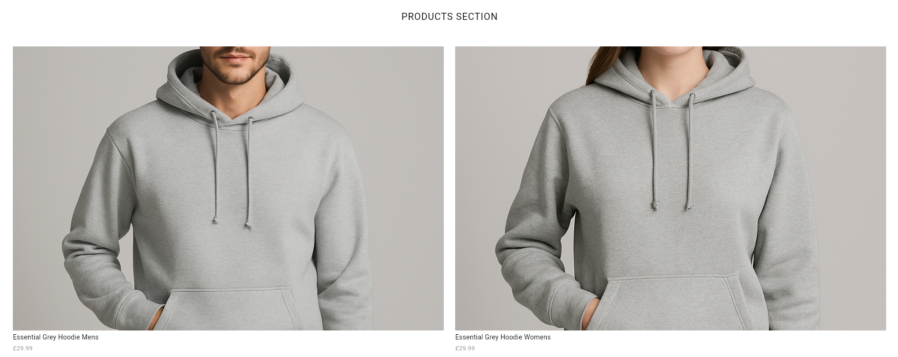
 homepage updated with dummy products.

 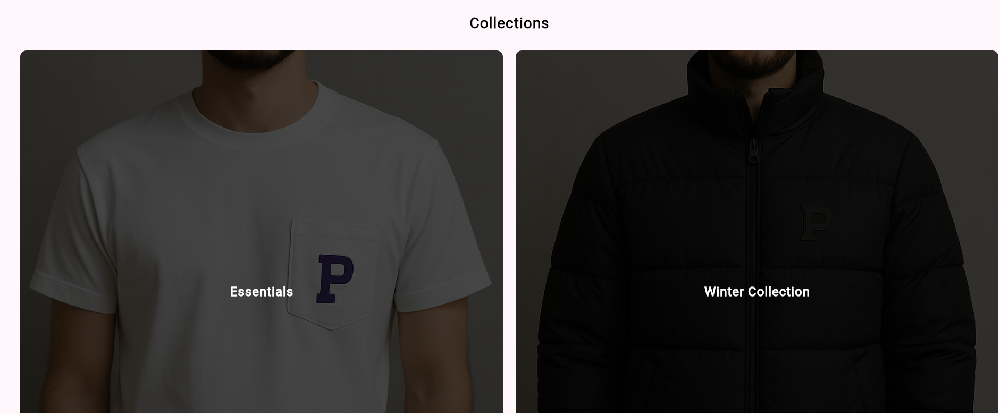
Pressing `Shop` Button takes you to Collections Page

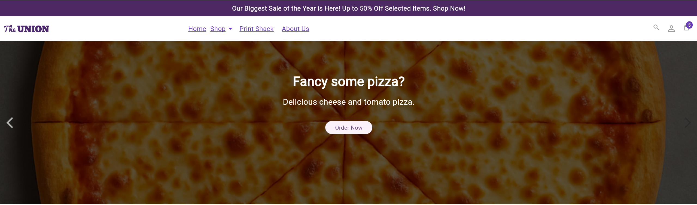
Hero slide updated with a second slide.

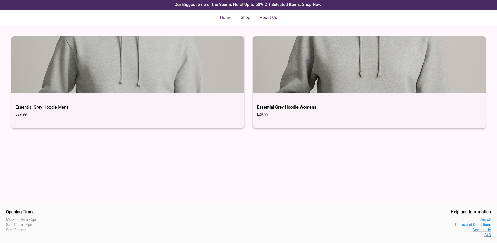
Pressing `Essentials` Button Displays 2 products in the Essentials Collection

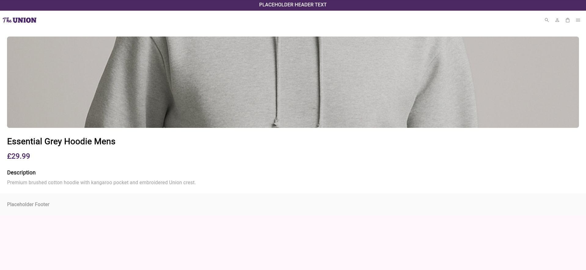
Clicking either the Mens or womens hoodie leads to a product page with its own description/details.

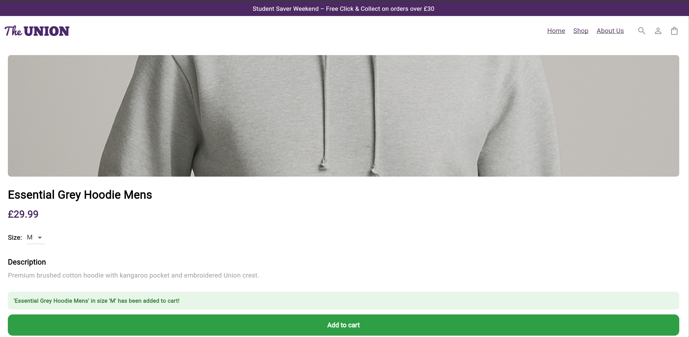
Clicking add to cart pops up with a confirmation message

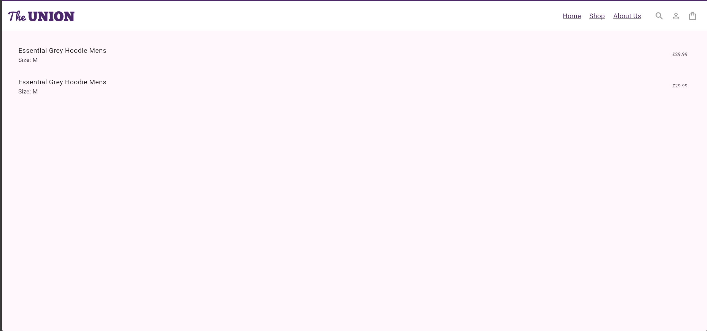
Cart now displays basic information (to be improved)

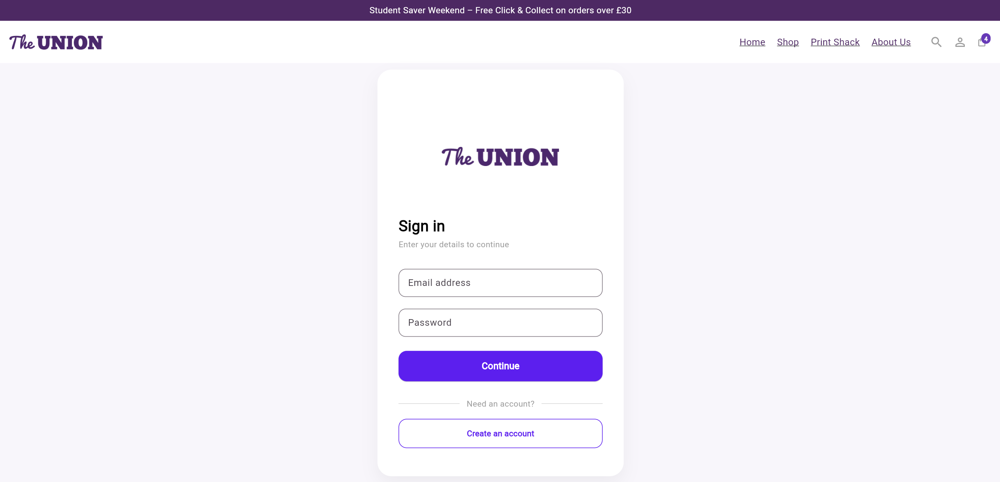
Clicking person icon shows login page


Clicking the Search Button on the navbar now opens a searchbar

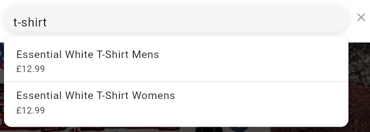
Searching for elements now creates a dropdown menu stemming from the searchbar

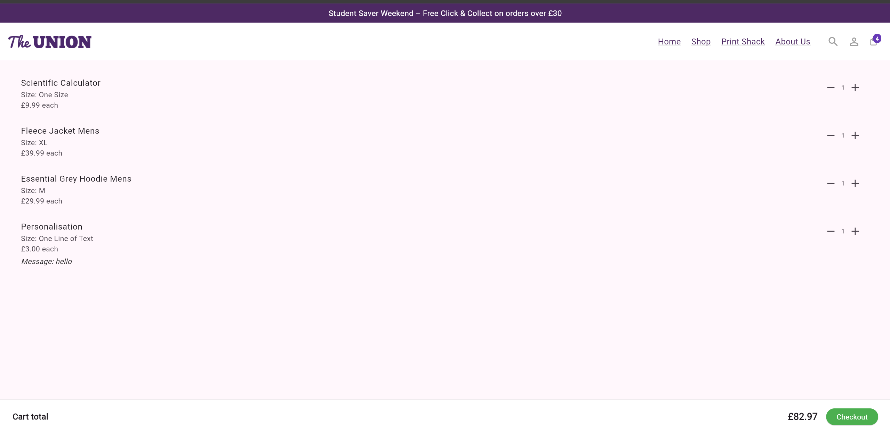
Cart page implemented showing a grand total and includes a checkout button

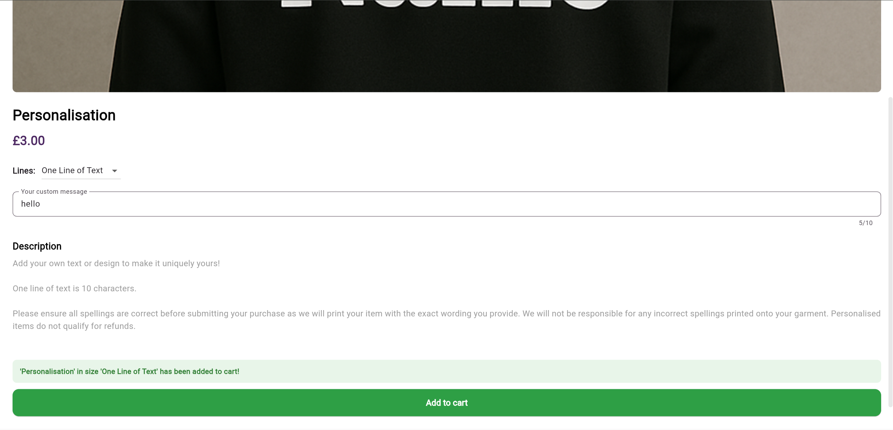
Personalisation Page supports text input

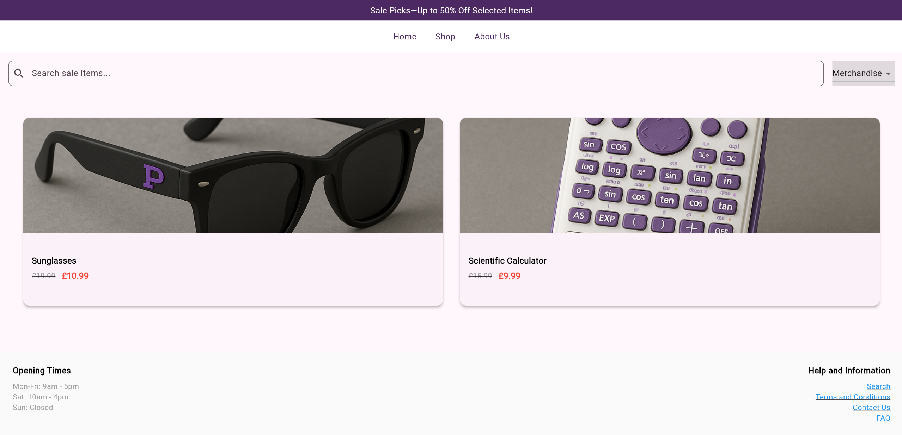
Filters in sale and essentials page

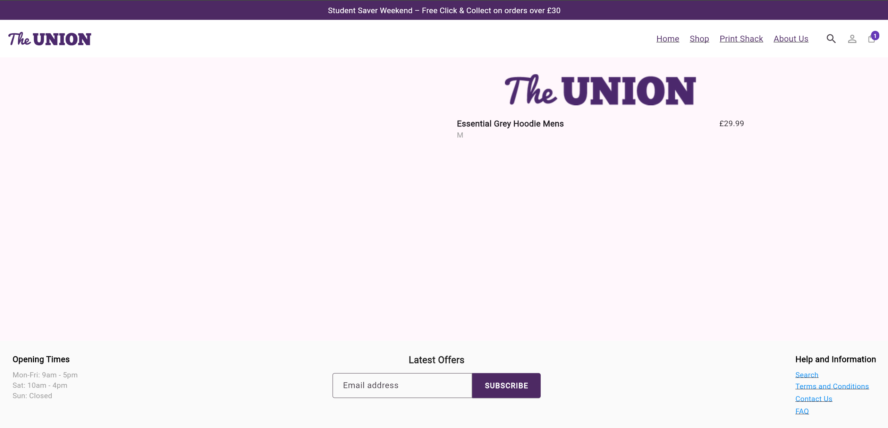
Basic creation of a Checkout page.

## Project Structure and Technologies Used
```
union_shop/
├── lib/
│   ├── main.dart             # Home, navbar, hero, footer
│   ├── cart_state.dart       # Shared cart ValueNotifier + model
│   ├── cart_page.dart        # Cart screen with ValueListenableBuilder
│   ├── product_page.dart     # Product detail template + add-to-cart
│   ├── sale_page.dart        # Sale listings
│   ├── collections_page.dart # Collections landing page
│   ├── essentials.dart       # Essentials collection view
│   ├── login_page.dart       # Login placeholder
│   └── widgets/
│       └── union_navbar.dart # Reusable navbar widget
├── assets/                   # Product and hero imagery
└── test/                     # Widget tests
```
### Technologies
- Technologies: Flutter, Dart

### Development Tools
- Development Tools: VS Code, Chrome DevTools, Flutter DevTools

## Known Issues or Limitations
- Assets use placeholder imagery (no backend integration).
- Additional collections (Winter, Merchandise, Personalisation) not yet routed.
- Cart, authentication, and search flows are not implemented.

## Future Improvements
- Add full routing for every collection tile.
- Implement product detail variations and cart management.
- Hook up data models/services for dynamic content and sorting.

## Contribution Guidelines
- Fork the repo, create feature branches, and submit pull requests.
- Follow Flutter/Dart formatting (dart fix, flutter format) before committing.

## Contact Information
- Github: sushisuj
- Email: sujanrajeshb@gmail.com
